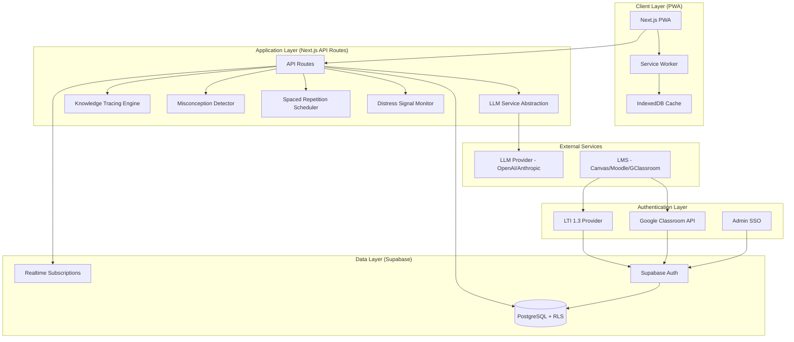

# Technical Design Document: Escolent MVP Adaptive Learning Platform

## Overview

### System Purpose

Escolent MVP is an AI-native adaptive learning platform targeting Grade 8 Mathematics (IEB-aligned algebraic equations). The platform embeds within existing LMS ecosystems (Canvas, Moodle, Google Classroom) to provide adaptive, personalized practice with honest mastery tracking. The core value proposition: schools currently track completion rather than mastery—students can finish exercises without understanding the material. Escolent shifts the metric from "work completed" to "concepts mastered."

### Target Deployment Context

- **Initial Pilot:** Teneo (online private K-12 school, South Africa), one Grade 8 class
- **Target Market Characteristics:** Low-end devices (2GB RAM, dual-core 1.5GHz), unreliable connectivity (2Mbps typical)
- **Geographic Scope:** South African market initially, with second pilot planned (Kenya)
- **Multi-Tenancy Model:** MVP is single-school deployment but architecturally designed for multiple tenants; second school should not require architectural rewrite

### Key Design Principles

1. **Mastery over Completion:** All system behavior optimizes for accurate mastery assessment, not task completion
2. **Offline-First Resilience:** Unreliable connectivity is the norm, not the exception
3. **Low-End Device Performance:** 2GB RAM, dual-core 1.5GHz is the baseline, not a degraded experience
4. **Multi-Tenancy from Day One:** Single-tenant shortcuts are forbidden; isolation by school is architectural
5. **LLM Provider Abstraction:** No pedagogy embedded in provider-specific prompts; swappable via config
6. **Safeguarding Over-Trigger Bias:** False positives in distress detection are acceptable; false negatives are not


## Architecture

### System Architecture Overview

Escolent employs a Progressive Web App (PWA) architecture built on Next.js 14+ (App Router), with Supabase as the backend platform providing PostgreSQL database, real-time subscriptions, authentication, and Row Level Security (RLS) for multi-tenancy enforcement.



### Component Architecture

The system follows a layered architecture with clear separation of concerns:

1. **Client Layer (PWA):** Next.js 14+ application with service worker for offline support, IndexedDB for local state persistence
2. **Authentication Layer:** LTI 1.3 integration for LMS launches, Google Classroom API for Google Classroom, separate Admin SSO
3. **Application Layer:** Next.js API routes implementing business logic for knowledge tracing, misconception detection, spaced repetition, and distress monitoring
4. **Data Layer:** Supabase providing PostgreSQL with Row Level Security (RLS) for multi-tenancy, real-time subscriptions for live dashboard updates
5. **External Services:** LLM provider abstraction supporting OpenAI/Anthropic/others via Vercel AI SDK

### Technology Stack

- **Frontend:** Next.js 14+ (App Router), React, TypeScript, Tailwind CSS
- **PWA:** Workbox for service worker, IndexedDB for offline storage
- **Backend:** Next.js API Routes, Vercel AI SDK for LLM abstraction
- **Database:** Supabase (PostgreSQL 15+)
- **Authentication:** Supabase Auth with custom LTI 1.3 provider integration
- **Real-time:** Supabase Realtime for live dashboard updates
- **Deployment:** Vercel (frontend + API routes), Supabase Cloud (database + auth)
- **Monitoring:** Vercel Analytics, Supabase logs


## Components and Interfaces

### 1. Authentication System

**Purpose:** Authenticate four distinct user roles (Student, Teacher, Admin, Pedagogical_Lead) via LMS launches or direct login.

**Role Characteristics:**
- **Student/Teacher:** LTI 1.3 (Canvas/Moodle) or Google Classroom API launch, tenant-scoped
- **Admin:** Direct login interface (SSO or username/password), tenant-scoped
- **Pedagogical_Lead:** Platform-level role (not tenant-scoped), curates misconception taxonomy and content across all schools

#### LTI 1.3 Integration

**Authentication Flow:**
1. User clicks Escolent link in Canvas/Moodle
2. LMS initiates LTI 1.3 OIDC launch with signed JWT
3. Next.js API route validates JWT signature using LMS public key
4. Extract user role (Student/Teacher), user ID, school ID (tenant), course context
5. Create or retrieve Supabase user, set RLS context with tenant_id
6. Generate session token, redirect to appropriate dashboard

**API Endpoints:**
- `POST /api/auth/lti/login` - Initiates OIDC flow
- `POST /api/auth/lti/launch` - Validates JWT, creates session
- `GET /api/auth/lti/jwks` - Publishes platform public keys for LMS validation

**Configuration Storage (per LMS):**
- LMS client ID, deployment ID, auth endpoint, token endpoint, JWKS URL
- Stored in Supabase `lms_configs` table with `tenant_id` foreign key


#### Google Classroom API Integration

**Authentication Flow:**
1. User clicks Escolent link in Google Classroom
2. Google Classroom passes course ID, user ID via OAuth 2.0
3. Next.js API route validates OAuth token with Google
4. Extract user role, course context, infer tenant from course ownership
5. Create or retrieve Supabase user, set RLS context
6. Generate session token, redirect to dashboard

**API Endpoints:**
- `GET /api/auth/google/callback` - OAuth callback handler
- `POST /api/auth/google/launch` - Validates token, creates session

#### Admin Direct Authentication

**Authentication Flow:**
1. Admin visits `/admin/login` (not LTI launch)
2. Admin enters credentials (SSO via Google/Microsoft or username/password)
3. Supabase Auth validates credentials
4. Check user has `admin` role in `user_roles` table
5. Set RLS context with tenant_id from user's school association
6. Redirect to admin dashboard

**API Endpoints:**
- `POST /api/auth/admin/login` - Admin credential validation
- `POST /api/auth/admin/logout` - Session termination


#### Pedagogical_Lead Authentication

**Special Case:** Pedagogical_Lead is NOT tenant-scoped. This role requires cross-school access to curate misconception taxonomy and content.

**Authentication Flow:**
1. Pedagogical_Lead logs in via `/pedagogical-lead/login`
2. Supabase Auth validates credentials
3. Check user has `pedagogical_lead` role (global, no tenant_id constraint)
4. RLS policies grant cross-tenant READ access to anonymized error patterns
5. Redirect to curation dashboard

**RLS Policy Special Case:**
```sql
-- Pedagogical_Lead can read unmatched_errors across ALL tenants
CREATE POLICY "pedagogical_lead_read_errors"
ON unmatched_errors FOR SELECT
USING (
  auth.uid() IN (
    SELECT user_id FROM user_roles WHERE role = 'pedagogical_lead'
  )
);

-- Pedagogical_Lead can INSERT/UPDATE misconceptions across all tenants
CREATE POLICY "pedagogical_lead_write_misconceptions"
ON misconceptions FOR INSERT
WITH CHECK (
  auth.uid() IN (
    SELECT user_id FROM user_roles WHERE role = 'pedagogical_lead'
  )
);

CREATE POLICY "pedagogical_lead_update_misconceptions"
ON misconceptions FOR UPDATE
USING (
  auth.uid() IN (
    SELECT user_id FROM user_roles WHERE role = 'pedagogical_lead'
  )
);
```


### 2. Skill Graph and Prerequisite System

**Purpose:** Represent IEB Grade 8 algebra skills as a directed acyclic graph (DAG) with prerequisite dependencies, enabling prerequisite-aware remediation.

**Data Structure:**

```typescript
interface Skill {
  id: string;              // UUID
  name: string;            // e.g., "Solving one-step linear equations"
  description: string;     // Plain-language explanation
  skill_type: 'procedural' | 'conceptual'; // Determines mastery threshold
  prerequisite_ids: string[];  // Array of prerequisite skill IDs (DAG edge)
  tenant_id: string | null;    // null = platform-level, else school-specific
  created_by: string;          // 'platform' | 'pedagogical_lead' | teacher_id
  evaluation_strategy: 'exact_match' | 'symbolic_equivalence' | 'rubric_llm';  // See Section 14a
  rubric?: { criterion: string; weight: number }[];  // required when evaluation_strategy = 'rubric_llm'
  content_status: 'draft' | 'pending_approval' | 'validated';  // See Section 14d
  coverage_status: 'rich' | 'thin' | 'gap' | 'not_assessed';  // See Section 18, computed from linked ContentSource records
}
```

**Storage:** `skills` table in PostgreSQL with `prerequisite_ids` as JSON array.

**Graph Traversal:**
- Breadth-first search (BFS) for prerequisite identification when student struggles
- Topological sort for determining skill unlock sequence
- Cycle detection validation on skill creation/modification

**Modification Interface:**
- Platform-level skills (tenant_id = null): only Pedagogical_Lead can modify
- School-specific skills: Teachers can extend graph within their tenant
- Graph structure stored in database, no code changes required for curriculum updates


### 3. Real-Time Knowledge Tracing Engine

**Purpose:** Maintain per-student, per-skill mastery probability estimates (Mastery_State), updated within 2 seconds of each response.

**Algorithm:** Simplified Bayesian Knowledge Tracing (BKT) with performance history weighting.

**Mastery_State Calculation:**

```typescript
interface MasteryState {
  student_id: string;
  skill_id: string;
  probability: number;     // 0.0 to 1.0
  last_updated: timestamp;
  response_history: ResponseRecord[];  // Last 10 responses
  is_tentatively_mastered: boolean;    // probability > threshold
  is_durably_mastered: boolean;        // mastered in 2+ sessions
  mastered_session_count: number;      // Sessions where probability > threshold
  tenant_id: string;       // Multi-tenancy isolation
}

interface ResponseRecord {
  is_correct: boolean;
  timestamp: timestamp;
  problem_difficulty: number;  // 1-5 scale
  response_time_ms: number;    // Tracked but NOT used in calculation
}
```

**Thresholds:**
- Procedural skills: 0.85 probability threshold for tentative mastery
- Conceptual skills: 0.90 probability threshold for tentative mastery
- Durable mastery: tentative mastery achieved in 2+ separate sessions (session separation >= 1 day)

**Note:** These specific threshold values (0.85/0.90) are provisional placeholders subject to refinement based on pilot data and pedagogical review. They represent reasonable starting points for implementation but should be validated and adjusted through real classroom use and consultation with the Pedagogical_Lead.


**Update Flow:**

1. Student submits answer
2. API route `/api/session/submit-response` receives response
3. Determine correctness (exact match, symbolic equivalence, or LLM evaluation for free-text)
4. Fetch current Mastery_State and last 10 responses from `mastery_states` table
5. Apply BKT update:
   - Correct answer: increase probability weighted by problem difficulty
   - Incorrect answer: decrease probability, check for prerequisite gaps
6. Update `mastery_states` table (target: < 2 seconds)
7. Check if threshold crossed → update `is_tentatively_mastered`
8. If offline: queue update in IndexedDB, sync when connectivity restored

**Offline Queueing:**
- All responses stored in IndexedDB with `synced: false` flag
- Background sync API attempts sync every 10 seconds when online
- Conflict resolution: server timestamp wins if multiple devices used

**Response Time Tracking:**
- Captured in `response_time_ms` for teacher diagnostic visibility
- Deliberately NOT used in mastery calculation to avoid penalizing low-end devices and ESL students


### 4. Misconception Detection and Remediation System

**Purpose:** Identify specific mathematical misconceptions (not just "wrong answers") and provide targeted remediation.

**Misconception Taxonomy Structure:**

```typescript
interface Misconception {
  id: string;              // UUID
  name: string;            // e.g., "Subtracting negative numbers as adding positives"
  description: string;     // Diagnostic explanation
  skill_id: string;        // Associated skill
  error_pattern: ErrorPattern;  // Pattern matching logic
  classification: 'repetition_confirmed' | 'first_occurrence_actionable';
  remediation_strategy: string;  // Plain-language guidance for LLM prompt
  example_errors: string[];      // Sample incorrect responses
  tenant_id: string | null;      // null = platform-level
  created_by: string;            // 'pedagogical_lead' | teacher_id
  content_status: 'draft' | 'pending_approval' | 'validated';  // See Section 14d
}

interface ErrorPattern {
  type: 'symbolic' | 'regex' | 'semantic';
  pattern: string;         // Pattern definition
  threshold?: number;      // For repetition_confirmed: occurrences needed
}
```


**Detection Flow:**

1. Student submits incorrect answer
2. API route `/api/misconception/detect` receives response
3. Pattern matching sequence (< 3 seconds total):
   - **Symbolic matching:** Exact symbolic pattern match (e.g., `-(-x)` → `x` instead of `+x`)
   - **Regex matching:** String pattern match for common errors
   - **Semantic matching:** LLM-based classification for complex errors
4. Check classification:
   - **first_occurrence_actionable:** Trigger remediation immediately
   - **repetition_confirmed:** Check student's error history for pattern frequency
5. If pattern matches, log to `student_misconceptions` table
6. If no match, log to `unmatched_errors` table for Pedagogical_Lead review
7. Return remediation strategy or generic Socratic prompt

**Unmatched Error Routing:**

```typescript
interface UnmatchedError {
  id: string;
  student_id_anonymized: string;  // Hashed for privacy
  skill_id: string;
  problem_text: string;
  student_response: string;
  correct_answer: string;
  timestamp: timestamp;
  tenant_id: string;       // For curation context
  reviewed: boolean;       // Pedagogical_Lead review flag
}
```

- Unmatched errors accessible to Pedagogical_Lead via `/pedagogical-lead/errors` dashboard
- WHEN a Pedagogical_Lead promotes an error to the misconception taxonomy, THE Platform pre-drafts the entry (name, description, classification, remediation strategy) via the LLM abstraction layer, using the same "propose, human approves" mechanism as the AI co-authoring flow (Section 14c) — never a blank manual form
- Meanwhile, student receives real-time Socratic-style prompt (not blocked by async curation)


**Language Comprehension Detection:**
- If student error frequency is uniform across skills but LLM detects language pattern issues, flag response for teacher review
- Flag appears in teacher dashboard: "Possible language comprehension difficulty"
- Teacher can manually intervene or request ESL support

**Note:** This heuristic ('uniform error frequency across skills') is provisional and subject to validation by the Pedagogical_Lead during pilot. Alternative detection strategies may be needed based on real pilot data.

### 5. Spaced Repetition Scheduler

**Purpose:** Resurface mastered skills at increasing intervals to ensure long-term retention.

**Algorithm:** SM-2 algorithm variant (SuperMemo 2) adapted for math skills.

**Scheduling Logic:**

```typescript
interface SpacedRepetitionSchedule {
  student_id: string;
  skill_id: string;
  next_review_date: timestamp;
  interval_days: number;    // Days until next review
  ease_factor: number;      // 1.3 to 2.5 (SM-2 default)
  consecutive_correct: number;
  tenant_id: string;
}
```

**Review Intervals:**
- First review: 1 day after durable mastery
- Second review: 3 days
- Subsequent: interval * ease_factor
- Ease factor increases with correct reviews, decreases with errors


**Session Integration:**
- At session start, query `spaced_repetition_schedules` for due reviews
- Inject review problems (max 20% of session problems)
- Interleave with new/struggling skill problems to avoid review-only sessions
- Update schedule based on performance:
  - Correct: increase interval
  - Incorrect: reset to shorter interval, mark skill for reteaching

### 6. Cognitive Load-Aware Scaffolding System

**Purpose:** Fade support from worked examples → partial support → independent practice based on mastery state.

**Scaffolding Levels:**

```typescript
type ScaffoldingLevel = 
  | 'worked_example'        // Mastery < 0.3: full solution shown, explanation provided
  | 'partial_scaffold'      // Mastery 0.3-0.7: hints available, partial solution
  | 'hint_on_demand'        // Mastery 0.7-threshold: hints available only if requested (skill-type-specific threshold from Req 3)
  | 'independent'           // Mastery >= threshold: no scaffolding (skill-type-specific threshold: 0.85 for procedural, 0.90 for conceptual)

interface ScaffoldedProblem {
  problem_id: string;
  skill_id: string;
  difficulty: number;
  scaffolding_level: ScaffoldingLevel;
  worked_solution?: string;    // Full solution for worked_example
  hints?: string[];            // Progressive hints for partial_scaffold
  hint_penalty: number;        // Mastery adjustment if hint requested
}
```

**Note:** These specific scaffolding band thresholds (0.3/0.7) are provisional placeholders subject to refinement based on pilot data and pedagogical review. They represent reasonable starting points for implementation but should be validated and adjusted through real classroom use and consultation with the Pedagogical_Lead.


**Scaffolding Selection Flow:**
1. Fetch student's current Mastery_State for skill
2. Map probability to scaffolding level
3. Generate/retrieve problem at appropriate level
4. If student requests hint during `independent` or `hint_on_demand`:
   - Provide hint
   - Apply `hint_penalty` (e.g., -0.05 to mastery probability)
   - Log hint request to track self-regulation behavior

### 7. Adaptive Practice Session Engine

**Purpose:** Orchestrate practice sessions that adapt to student's current mastery state, prerequisite gaps, and space boundaries.

**Session State Machine:**

```typescript
interface Session {
  id: string;
  student_id: string;
  space_id: string;
  start_time: timestamp;
  last_activity: timestamp;
  status: 'active' | 'paused' | 'completed' | 'interrupted';
  problems_completed: number;
  problems: ProblemInstance[];
  tenant_id: string;
}

interface ProblemInstance {
  problem_id: string;
  skill_id: string;
  presented_at: timestamp;
  response?: string;
  is_correct?: boolean;
  hints_requested: number;
  problem_type: 'new_learning' | 'prerequisite_remediation' | 'spaced_review';
}
```


**Problem Selection Algorithm:**

1. Fetch Space boundaries (included skill IDs, difficulty range, classroom pacing mode)
2. Fetch student's Mastery_State for all Space skills
3. Check for due spaced repetition reviews (max 20% of session)
4. Identify skills needing practice:
   - **Struggling:** mastery < 0.5, recent errors
   - **Emerging:** mastery 0.5-0.85, needs consolidation
   - **New:** not yet attempted, prerequisites met
5. If classroom pacing mode enabled:
   - Prioritize Space-defined skills even if prerequisites not mastered
   - Flag prerequisite gaps for teacher (don't auto-remediate)
6. If classroom pacing mode disabled:
   - Auto-inject prerequisite remediation when gaps detected
   - Return to space skills after remediation
7. Select problem at appropriate scaffolding level
8. Present problem to student

**Natural Stopping Points:**
- After 10-15 problems OR 15-20 minutes elapsed
- UI suggests: "Great progress! You can stop here or keep going."
- Student chooses to continue or end session

**Autosave:**
- Every 30 seconds OR after each response (whichever first)
- Save session state to `sessions` table
- Also persist to IndexedDB for offline resilience


### 8. Offline-First Architecture

**Purpose:** Enable students to continue practicing during connectivity loss, with automatic sync when restored.

**Service Worker Strategy (Workbox):**

- **Cache-First:** Static assets (JS, CSS, images), skill graph data, problem templates
- **Network-First with Cache Fallback:** API calls for new problems, LLM responses
- **Background Sync:** Queued responses sync automatically when online

**IndexedDB Schema (Client-Side):**

```typescript
// ObjectStores:
- sessions: Current session state
- responses: Unsynced student responses (sync_status: 'pending' | 'synced')
- problems: Cached problem instances
- mastery_cache: Local copy of mastery states (read-only, sync from server)
```

**Offline Flow:**

1. Connectivity lost mid-session
2. Service worker intercepts API calls, returns cached data or error
3. Student continues answering loaded problems
4. Responses saved to IndexedDB `responses` store with `sync_status: 'pending'`
5. UI displays offline indicator
6. Background sync task attempts sync every 10 seconds
7. When online, sync all pending responses to `/api/sync/responses`
8. Server validates, updates mastery states, returns updated data
9. Client updates local cache, marks responses as `synced`


**Session State Recovery:**
- If browser closed or connectivity lost, session state persists in IndexedDB
- On return, check for `interrupted` sessions < 24 hours old
- Prompt: "You have an unfinished session. Resume?"
- If resumed, restore exact problem and student responses
- If expired (> 24 hours), mark session as `expired`, start fresh

### 9. Teacher Space Management System

**Purpose:** Enable teachers to create bounded practice environments with specific curriculum scope.

**Space Data Model:**

```typescript
interface Space {
  id: string;
  name: string;
  description: string;
  teacher_id: string;
  tenant_id: string;          // Multi-tenancy isolation
  included_skill_ids: string[]; // Subset of skill graph
  difficulty_range: [number, number]; // [min, max] difficulty (1-5)
  classroom_pacing_mode: boolean;  // Override prerequisite auto-remediation
  content_summary_generated_at: timestamp | null;  // See Section 18 — freshness of the cached aggregate coverage view
  created_at: timestamp;
  updated_at: timestamp;
}

interface SpaceEnrollment {
  space_id: string;
  student_id: string;
  enrolled_at: timestamp;
  tenant_id: string;
}
```


**Space Management Interface:**

- `/teacher/spaces` - List all spaces created by teacher
- `/teacher/spaces/new` - Create space wizard:
  1. Name and description
  2. Select skills from graph (visual tree picker)
  3. Set difficulty range
  4. Toggle classroom pacing mode
  5. Assign students
- `/teacher/spaces/{id}/edit` - Modify space configuration
- Changes apply to future sessions only (not in-progress sessions)

**Classroom Pacing Mode:**
- **Enabled:** Students practice only Space skills, even if prerequisites not mastered
  - Prerequisite gaps flagged in teacher dashboard
  - Teacher manually decides intervention
- **Disabled:** System auto-injects prerequisite remediation when gaps detected
  - Returns to Space skills after remediation
  - More adaptive but less aligned with classroom pacing

### 10. Teacher Dashboard and Real-Time Visibility

**Purpose:** Provide teachers with live mastery visibility across all students.

**Dashboard UI Components:**

1. **Mastery Heatmap:** Grid of students (rows) × skills (columns), color-coded by mastery state
2. **Prerequisite Gap Alerts:** List of students with flagged gaps, skill identified
3. **Misconception Tracker:** Most common misconceptions this week, student counts
4. **Session Activity:** Live indicator when students practicing, last activity timestamp


**Real-Time Updates (Supabase Realtime):**

```typescript
// Subscribe to mastery_states changes for teacher's students
const subscription = supabase
  .channel('teacher_mastery_updates')
  .on(
    'postgres_changes',
    {
      event: 'UPDATE',
      schema: 'public',
      table: 'mastery_states',
      filter: `student_id=in.(${studentIds})`
    },
    (payload) => {
      updateDashboard(payload.new);
    }
  )
  .subscribe();
```

**Filters:**
- By Space: Show only students in selected Space
- By Skill: Show all students' mastery for specific skill
- By Student: Drill down to individual student's full skill profile

**Mastery State Visual Encoding:**
- **Gray:** Not attempted (mastery = 0)
- **Red:** Struggling (mastery < 0.5)
- **Yellow:** Emerging (mastery 0.5-0.85)
- **Green:** Tentatively mastered (mastery >= threshold, < 2 sessions)
- **Dark Green:** Durably mastered (mastery >= threshold, 2+ sessions)


### 11. Teacher Override System

**Purpose:** Allow teachers to manually mark skills as mastered based on direct observation (e.g., oral assessment, classwork).

**Override Data Model:**

```typescript
interface MasteryOverride {
  id: string;
  student_id: string;
  skill_id: string;
  teacher_id: string;
  reason: string;              // Required justification
  override_type: 'mark_mastered' | 'reset_mastery';
  applied_at: timestamp;
  tenant_id: string;
}
```

**Override Flow:**

1. Teacher clicks "Override" on student's skill in dashboard
2. Modal prompts for reason (free text, 20-200 chars)
3. Submit override to `/api/teacher/override`
4. Update `mastery_states` table: set `is_durably_mastered = true`, `probability = 1.0`
5. Insert record to `mastery_overrides` table
6. Real-time update to student's dashboard (if online)

**Review Prompts:**
- After 30 days, teacher dashboard shows: "You marked [Student] as mastered in [Skill] 30 days ago. Confirm or reassess?"
- Teacher can confirm, reset, or ignore prompt


### 12. Distress Signal Detection and Escalation System

**Purpose:** Detect student distress in free-text responses and escalate to teachers immediately.

**Detection Strategy (Multi-Layer):**

1. **Pattern-Based Detection (Fast):** Regex patterns for explicit distress language
   - Keywords: "hurt myself", "want to die", "no point", "end it all", etc.
   - Threshold: Single match triggers escalation (over-trigger bias)

2. **Contextual Analysis (LLM-Based):** Semantic analysis for implicit distress
   - Prompt: "Analyze this student response for signs of distress, hopelessness, or self-harm intent. Respond with JSON: {is_distress: boolean, confidence: number, reason: string}"
   - Confidence threshold: 0.6 (lower threshold = over-trigger bias)

**Escalation Flow:**

1. Student submits response
2. Run pattern detection (< 100ms)
3. If pattern match → immediate escalation
4. If no pattern match → async LLM analysis
5. If LLM detects distress → escalation
6. Escalation creation:
   - Insert to `distress_escalations` table
   - Send real-time notification to teacher (Supabase Realtime + email, optionally SMS via Twilio for production scale)
   - Display to student: "Your teacher has been notified and will follow up with you."


**Escalation Data Model:**

```typescript
interface DistressEscalation {
  id: string;
  student_id: string;
  session_id: string;
  response_text: string;       // Student's concerning response
  detection_method: 'pattern' | 'llm';
  confidence: number;
  created_at: timestamp;
  acknowledged_by?: string;    // Teacher ID
  acknowledged_at?: timestamp;
  backup_notified: boolean;
  tenant_id: string;
}
```

**Backup Notification:**
- If primary teacher has not acknowledged within 10 minutes
- Send notification to backup teacher (configured per Space)
- If no backup configured, notify tenant Admin

**Safeguarding Constraint:**
- Platform NEVER provides counseling or mental health advice to students
- Message to student: "Your teacher has been notified and will follow up with you."
- All escalations logged with full context for teacher review


### 13. LLM Provider Abstraction Layer

**Purpose:** Isolate LLM provider API calls to enable swapping providers via configuration only.

**Abstraction Interface (Vercel AI SDK):**

```typescript
interface LLMProvider {
  generateResponse(prompt: string, context: LLMContext): Promise<string>;
  classifyError(response: string, correctAnswer: string): Promise<MisconceptionMatch>;
  detectDistress(text: string): Promise<DistressDetection>;
}

interface LLMContext {
  skill: Skill;
  student_mastery: number;
  scaffolding_level: ScaffoldingLevel;
  misconception_taxonomy: Misconception[];
}
```

**Provider Configuration:**

```typescript
// config/llm.ts
export const llmConfig = {
  provider: process.env.LLM_PROVIDER, // 'openai' | 'anthropic' | 'gemini'
  apiKey: process.env.LLM_API_KEY,
  model: process.env.LLM_MODEL,       // e.g., 'gpt-4', 'claude-3-opus'
  temperature: 0.7,
};
```

**Default Provider Selection:**
- **Primary (default):** Anthropic Claude (claude-3-5-sonnet) for general Socratic tutoring, misconception remediation, and distress detection
- **Secondary use case:** Google Gemini for Google Africa Applied AI Lab partnership requirements (specific use case to be determined based on partnership needs)
- Provider is configurable via environment variable to support experimentation and failover

**Vercel AI SDK Implementation:**

```typescript
import { openai } from '@ai-sdk/openai';
import { anthropic } from '@ai-sdk/anthropic';
import { google } from '@ai-sdk/google';
import { generateText } from 'ai';

const getModel = () => {
  switch (llmConfig.provider) {
    case 'openai': return openai(llmConfig.model);
    case 'anthropic': return anthropic(llmConfig.model);
    case 'gemini': return google(llmConfig.model);
    default: throw new Error(`Unsupported provider: ${llmConfig.provider}`);
  }
};

export const generateResponse = async (prompt: string) => {
  const { text } = await generateText({
    model: getModel(),
    prompt,
    temperature: llmConfig.temperature,
  });
  return text;
};
```


**Prompt Templates (Provider-Agnostic):**

```typescript
// No pedagogy embedded in prompts - all instructional logic in code
const socraticPromptTemplate = (context: LLMContext, studentError: string) => `
You are a Grade 8 mathematics tutor. The student is learning: ${context.skill.name}.
The student's current mastery level is ${context.student_mastery * 100}%.
The student provided this incorrect answer: "${studentError}"

Provide a Socratic-style hint that guides the student to discover the error without giving the answer directly.
Keep the response under 50 words, suitable for a Grade 8 student.
`;
```

**Key Principle:** Pedagogy lives in application code (skill graph, mastery thresholds, scaffolding levels), NOT in LLM prompts. This ensures swapping providers doesn't change educational behavior.


### 14. Subject-Agnostic Evaluation and AI-Assisted Content Authoring

**Purpose:** Generalize answer evaluation and misconception detection beyond math's structured-answer shape, and let a Teacher or Pedagogical_Lead bootstrap a new subject quickly via an AI-proposed draft that requires explicit human approval before any Student sees it.

#### 14a. Pluggable Answer Evaluation Strategy

Each Skill declares its own evaluation strategy rather than the Platform assuming one globally:

```typescript
type EvaluationStrategy = 'exact_match' | 'symbolic_equivalence' | 'rubric_llm';

interface RubricCriterion {
  criterion: string;        // e.g., "Thesis statement is clearly stated"
  weight: number;           // relative weight in overall correctness judgment
}

interface Skill {
  // ...existing fields (see Skill Graph, Section 2)
  evaluation_strategy: EvaluationStrategy;
  rubric?: RubricCriterion[];  // required when evaluation_strategy = 'rubric_llm'
}
```

**Evaluation flow:**
1. Fetch the Skill's declared `evaluation_strategy`.
2. `exact_match` / `symbolic_equivalence`: existing math-style correctness check (Section 3's Update Flow).
3. `rubric_llm`: pass the Student's response and the Skill's `rubric` to the LLM abstraction layer (Section 13); the LLM scores against each criterion, producing a correctness/partial-credit judgment and per-criterion feedback rather than a binary right/wrong.
4. The Mastery_State update (Section 3) consumes whichever judgment comes back — the BKT update logic itself doesn't need to know which strategy produced it.

**Why this doesn't touch the knowledge-tracing core:** Section 3's mastery update already operates on a correctness signal, not on the answer itself. Making evaluation pluggable is additive — it changes how the correctness signal is produced, not how it's consumed.

#### 14b. Misconception Detection Defaults for Non-Symbolic Subjects

The existing `ErrorPattern.type` (`symbolic | regex | semantic`, Section 4) already anticipates this. The addition is a stated default: **for any Skill using `rubric_llm` evaluation, misconception detection defaults to `semantic` matching** — the LLM classifies the response against the Misconception_Taxonomy's descriptions rather than attempting symbolic/regex matching, which doesn't apply to open-ended text. Symbolic and regex matching remain available as a math-specific fast-path, not the general case.

#### 14c. AI-Assisted Content Co-Authoring Flow

**Authoring flow:**
1. Teacher or Pedagogical_Lead provides a plain-language description of the subject/unit (e.g., "Grade 8 Natural Sciences, the water cycle").
2. The LLM abstraction layer generates a **draft** Skill_Graph (skills, prerequisites, skill_type, suggested evaluation_strategy) and a **draft** Misconception_Taxonomy (informed by general pedagogical knowledge and any existing similar content already on the Platform), tagged `content_status: 'draft'`.
3. Draft content is presented in a review UI — the author can edit skill names/descriptions, adjust prerequisite links, merge or split skills, edit or remove proposed misconceptions, and adjust the rubric before anything is approved.
4. **Nothing with `content_status: 'draft'` is served to Students until explicit approval** — this is the same non-negotiable human-approval gate already established for Charti's assistant, extended to any authoring teacher.
5. Once approved, draft content becomes live (servable to Students) but remains tagged `draft` for confidence-display purposes until promoted (see 14d).

**API Endpoints:**
- `POST /api/content/authoring/propose` — Input: `{ subject_description: string, grade_level: string }` — Output: `{ draft_skill_graph: Skill[], draft_misconceptions: Misconception[] }`
- `POST /api/content/authoring/approve` — Input: `{ skill_ids: string[], misconception_ids: string[] }` — moves reviewed/edited content from `content_status: 'draft'` to `'pending_approval'`, awaiting final sign-off
- `POST /api/content/authoring/sign-off` — Input: `{ skill_ids: string[], misconception_ids: string[] }` — moves `'pending_approval'` content to `'validated'`, making it servable to Students
- `PUT /api/content/authoring/skills/:id` / `PUT /api/content/authoring/misconceptions/:id` — teacher edits before or after approval

#### 14d. Content Trust Tiering

```typescript
type ContentStatus = 'draft' | 'pending_approval' | 'validated';
```

Added to both `Skill` and `Misconception` (Section 2 and Section 4 data structures, and their corresponding tables). A deliberate three-stage model, confirmed against the design system's Content Status Badge component — `draft` and `pending_approval` are kept visually and semantically distinct because they carry different responsibility: AI-proposed and untouched, versus already reviewed/edited by a human and awaiting final sign-off.

**Behavior by status:**
- `draft`: AI-proposed, not yet reviewed by a human. Never servable to Students.
- `pending_approval`: a Teacher or Pedagogical_Lead has reviewed and edited the content, awaiting final sign-off from the content owner. Still not servable to Students.
- `validated`: signed off and live to Students. Full-confidence display, no reduced-confidence flag. This is the only status under which content reaches a Student.

**This supersedes the earlier "draft content can be servable once approved" model** — `validated` is now the sole go-live gate, which is a stricter and clearer rule than the original two-state version. Promotion from `pending_approval` to `validated` requires explicit human sign-off from the content owner (Teacher for Space-level content, Pedagogical_Lead for platform-level content) — never automatic, and never based on accumulated usage volume alone.


### 15. Parent Identity Verification and Data Rights

**Purpose:** Verify that a data rights requester is genuinely a registered Guardian before processing any access, correction, or deletion request — no persistent Parent account, verification scoped to a single request.

```typescript
interface Guardian {
  id: string;
  student_id: string;
  tenant_id: string;
  full_name: string;
  contact_channel: 'whatsapp' | 'sms' | 'email';
  contact_value: string;   // provided by the school at enrollment, not by the requester
  relationship: string;
  created_at: timestamp;
}

interface DataRightsRequest {
  id: string;
  student_id: string;
  tenant_id: string;
  request_type: 'access' | 'correction' | 'deletion';
  guardian_id: string;
  verification_token: string;
  verified_at: timestamp | null;
  status: 'pending_verification' | 'verified' | 'completed' | 'expired';
  created_at: timestamp;
}
```

**Verification flow:**
1. A requester submits a student identifier and their own contact value.
2. The Platform checks for a matching registered `Guardian.contact_value` for that Student — a match alone is not sufficient proof of identity.
3. A verification token is sent to that same on-file contact channel (never to a value the requester supplies fresh) — proving access to the channel, not just knowledge of it.
4. The requester enters the token; only then does `status` become `verified`, and only then can the underlying access/export/deletion action (Requirement 25, existing endpoints in tasks.md 21.1) proceed.
5. If the Student has multiple registered Guardians, the tenant's Admin is notified of the request for awareness — this does not block or delay the verified Guardian's request; final custody/access disputes remain the school's responsibility, not the Platform's to adjudicate.

**API Endpoints:**
- `POST /api/parent/verify-request` — Input: `{ student_identifier: string, contact_value: string, request_type: 'access'|'correction'|'deletion' }` — Output is identical in shape and timing whether or not a match was found (Requirement 35.2a) — a genuine non-match and a token-sent response must be indistinguishable to the caller; only the on-file contact channel ever receives a visible signal
- `POST /api/parent/confirm-token` — Input: `{ request_id: string, token: string }` — confirms verification, unlocks the underlying data-rights action


### 16. Adaptive Instruction

**Purpose:** Make first exposure to a new Skill adaptive — grounded in what the Student already knows, delivered through one of a small, fixed set of reusable teaching strategies — without any per-Skill authored variants.

```typescript
interface Lens {
  id: string;
  name: string;              // e.g., 'concrete_analogy', 'procedural', 'narrative', 'socratic'
  description: string;
  template_rules: string;    // structural guidance for the LLM: tone, structure, length, what it must accomplish
  default_for_skill_type: 'procedural' | 'conceptual' | null;
}
```

**Flow:**
1. **Prerequisite check (passive):** before presenting a new Skill's instruction, look up the Student's existing Mastery_State for its direct prerequisites — no new data collection, reuses the existing skill graph and mastery tables.
2. **If a prerequisite is tentative, stale, or unassessed:** a brief bridge is woven into the opening of the new lesson itself, not a separate detour.
3. **Default Lens selection:** derived from the Skill's `skill_type` — no per-Skill configuration needed.
4. **Delivery:** the LLM abstraction layer (Section 13) generates the explanation from the Skill's base description plus the selected Lens's `template_rules` — the Lens is structure, not content; the LLM never invents a new pedagogical approach.
5. **On a wrong first practice attempt:** a fixed, platform-level switching policy selects a Lens that differs meaningfully from the one just used, and remediation is regenerated through it — no per-Skill, per-Misconception authored mapping required.
6. **No style selection, ever:** the Student is never asked which explanation approach they prefer — Lens selection and switching are invisible to them, driven entirely by skill_type defaults and the fixed switching policy (Requirement 34.7). This is a deliberate boundary: self-reported learning-style preference is not well-evidenced, and asking would reintroduce exactly the pattern this design was built to avoid.
7. **Content maturity:** generated Lens-plus-Skill explanation content is tagged `content_status: 'draft'` on first generation and promoted to `'validated'` through the same mechanism as other AI-proposed content (Section 14d) — not a separate governance model.

**Storage:** `lenses` table — small, fixed, platform-level (not tenant- or subject-scoped), edited rarely.


### 17. LMS Content Ingestion and Structuring

**Purpose:** Ground Skill content and misconception authoring in material a school already has, without ever mutating the source.

**Extraction (Stage 1):** text pages extracted directly; PDFs/Word documents via text extraction with OCR fallback for scanned documents; images via OCR plus visual description (both via the existing multimodal LLM abstraction layer — no new dependency). Video ingestion is explicitly out of MVP scope (Requirement 33.6).

**Structuring (Stage 2):** AI-driven synthesis across the extracted corpus for a topic — deduplication of redundant material, coverage assessment per Skill, and citation-preserving summarization. Output is `draft` Content_Status, same governance as any other AI-proposed content.

```typescript
interface ContentSource {
  id: string;
  skill_id: string;
  tenant_id: string;
  source_type: 'lms_page' | 'pdf' | 'word_doc' | 'image';
  source_reference: string;   // link/path back to the original in the LMS — never discarded
  extracted_text: string;
  created_at: timestamp;
}

interface ContentIngestionJob {
  id: string;
  tenant_id: string;
  status: 'pending' | 'extracting' | 'structuring' | 'complete' | 'failed';
  source_count: number;
  started_at: timestamp;
  completed_at: timestamp | null;
}
```

**Fallback:** where ingested content for a Skill is sparse or absent, the flow falls back to the plain-language-description authoring flow (Section 14c) automatically — no separate mode a Teacher has to select.


### 18. AI-Native Content Experience (Course/Skill Map)

**Purpose:** Serve the reorganized, skill-based content view that replaces native chronological LMS browsing — the backend supporting the Course/Skill Map UX.

- Each Skill's `coverage_status` (`rich` / `thin` / `gap` / `not_assessed`) is computed from its linked `ContentSource` records — multiple sources across types → rich; a single source → thin; none → gap.
- A Space's aggregate coverage view is computed over its `included_skill_ids`' coverage statuses, cached rather than computed live on every request (Space's `content_summary_generated_at` field, Data Models section, tracks freshness).
- Content_Status (draft/validated) is visible to Teachers, Pedagogical_Leads, and Admins; never shown to Students (Requirement 32.6).

**API Endpoints:**
- `GET /api/student/course-map` — returns Skills in Skill_Graph order with synthesized summary and source citation
- `GET /api/teacher/space/:id/coverage` — aggregate per-Skill coverage view for a Space


### 19. AI-Assisted Dashboard Interpretation

**Purpose:** Close the gap between AI-computed data and human understanding of it. The Teacher Dashboard and Admin Metrics screens display real, AI-computed data (Mastery_State, Misconception frequency, adoption metrics) — but display alone still leaves the *interpretation* work to the human. This component lets a Teacher or Admin ask a plain-language question and get a synthesized, grounded answer instead of having to read the pattern out of a grid themselves (Requirements 10.8, 15.5).

**Design principle: retrieval-grounded generation, never free generation.** The LLM is never asked to "answer a question about a teacher's students" from its own knowledge — it is given the *actual retrieved data* as context and instructed to synthesize only from what's provided. This is the same discipline already used for content citation elsewhere in the product (Course/Skill Map's source links) applied to numeric/aggregate data instead of text content.

**Flow:**
1. Teacher or Admin submits a plain-language question via a persistent, low-key entry point on their respective dashboard (matching the "Ask about a skill" pattern already established on the Student Home Screen).
2. The backend runs a structured query against the actual underlying data scoped to that Teacher's Students/Spaces (or that Admin's tenant) — `mastery_states`, `student_misconceptions`, `sessions`, aggregated as needed. No LLM call happens before this retrieval step.
3. The retrieved, real data is passed to the LLM abstraction layer (Section 13) as context, along with the question and an explicit instruction: synthesize an answer only from the provided data; never state a number, name, or trend not present in it.
4. The response is returned to the Teacher/Admin, with the underlying data it drew from available on request (consistent with source-citation discipline elsewhere).

**API Endpoints:**
- `POST /api/teacher/dashboard/ask` — Input: `{ question: string }` — Output: `{ answer: string, grounded_in: object }` (the retrieved data the answer was synthesized from)
- `POST /api/admin/metrics/ask` — same shape, scoped to tenant-wide data

**Failure handling:** if the retrieved data can't answer the question (e.g., asking about a Skill outside the Teacher's Spaces), the response says so plainly rather than the LLM guessing — consistent with the "never fabricated" requirement.


## Data Models

### Database Schema (PostgreSQL via Supabase)

#### Multi-Tenancy Foundation

All tables (except platform-level data) include `tenant_id` with Row Level Security (RLS) policies enforcing isolation.

```sql
-- Tenants (schools)
CREATE TABLE tenants (
  id UUID PRIMARY KEY DEFAULT uuid_generate_v4(),
  name TEXT NOT NULL,
  slug TEXT UNIQUE NOT NULL,  -- URL-safe identifier
  billing_status TEXT CHECK (billing_status IN ('trial', 'active', 'suspended')),
  created_at TIMESTAMPTZ DEFAULT NOW()
);

-- Users (Students, Teachers, Admins, Pedagogical_Lead)
CREATE TABLE users (
  id UUID PRIMARY KEY DEFAULT uuid_generate_v4(),
  tenant_id UUID REFERENCES tenants(id) ON DELETE CASCADE,  -- NULL for Pedagogical_Lead
  email TEXT UNIQUE NOT NULL,
  full_name TEXT,
  lms_user_id TEXT,  -- LTI user ID from Canvas/Moodle
  google_classroom_id TEXT,
  created_at TIMESTAMPTZ DEFAULT NOW()
);

CREATE TABLE user_roles (
  user_id UUID REFERENCES users(id) ON DELETE CASCADE,
  role TEXT CHECK (role IN ('student', 'teacher', 'admin', 'pedagogical_lead')),
  tenant_id UUID REFERENCES tenants(id) ON DELETE CASCADE,  -- NULL for pedagogical_lead
  PRIMARY KEY (user_id, role)
);
```


#### Skill Graph

```sql
CREATE TABLE skills (
  id UUID PRIMARY KEY DEFAULT uuid_generate_v4(),
  name TEXT NOT NULL,
  description TEXT,
  skill_type TEXT CHECK (skill_type IN ('procedural', 'conceptual')),
  prerequisite_ids UUID[] DEFAULT '{}',  -- Array of prerequisite skill IDs
  tenant_id UUID REFERENCES tenants(id) ON DELETE CASCADE,  -- NULL = platform-level
  created_by TEXT,  -- 'platform' | 'pedagogical_lead' | teacher user_id
  evaluation_strategy TEXT CHECK (evaluation_strategy IN ('exact_match', 'symbolic_equivalence', 'rubric_llm')) DEFAULT 'exact_match',
  rubric JSONB,  -- [{criterion, weight}], required when evaluation_strategy = 'rubric_llm'
  content_status TEXT CHECK (content_status IN ('draft', 'pending_approval', 'validated')) DEFAULT 'draft',
  coverage_status TEXT CHECK (coverage_status IN ('rich', 'thin', 'gap', 'not_assessed')) DEFAULT 'not_assessed',
  created_at TIMESTAMPTZ DEFAULT NOW()
);

CREATE INDEX idx_skills_tenant ON skills(tenant_id);
CREATE INDEX idx_skills_prerequisites ON skills USING GIN(prerequisite_ids);
```

#### Mastery States

```sql
CREATE TABLE mastery_states (
  student_id UUID REFERENCES users(id) ON DELETE CASCADE,
  skill_id UUID REFERENCES skills(id) ON DELETE CASCADE,
  probability NUMERIC(4, 3) CHECK (probability >= 0 AND probability <= 1),  -- 0.000 to 1.000
  last_updated TIMESTAMPTZ DEFAULT NOW(),
  response_history JSONB DEFAULT '[]',  -- Last 10 responses [{is_correct, timestamp, difficulty, response_time_ms}]
  is_tentatively_mastered BOOLEAN DEFAULT FALSE,
  is_durably_mastered BOOLEAN DEFAULT FALSE,
  mastered_session_count INT DEFAULT 0,
  tenant_id UUID REFERENCES tenants(id) ON DELETE CASCADE,
  PRIMARY KEY (student_id, skill_id)
);

CREATE INDEX idx_mastery_student ON mastery_states(student_id, tenant_id);
CREATE INDEX idx_mastery_skill ON mastery_states(skill_id, tenant_id);
```


#### Misconception Taxonomy

```sql
CREATE TABLE misconceptions (
  id UUID PRIMARY KEY DEFAULT uuid_generate_v4(),
  name TEXT NOT NULL,
  description TEXT,
  skill_id UUID REFERENCES skills(id) ON DELETE CASCADE,
  error_pattern JSONB NOT NULL,  -- {type: 'symbolic'|'regex'|'semantic', pattern: string, threshold?: number}
  classification TEXT CHECK (classification IN ('repetition_confirmed', 'first_occurrence_actionable')),
  remediation_strategy TEXT,
  example_errors TEXT[],
  tenant_id UUID REFERENCES tenants(id) ON DELETE CASCADE,  -- NULL = platform-level
  created_by TEXT,
  content_status TEXT CHECK (content_status IN ('draft', 'pending_approval', 'validated')) DEFAULT 'draft',
  created_at TIMESTAMPTZ DEFAULT NOW()
);

CREATE TABLE student_misconceptions (
  id UUID PRIMARY KEY DEFAULT uuid_generate_v4(),
  student_id UUID REFERENCES users(id) ON DELETE CASCADE,
  misconception_id UUID REFERENCES misconceptions(id) ON DELETE CASCADE,
  occurrence_count INT DEFAULT 1,
  first_detected TIMESTAMPTZ DEFAULT NOW(),
  last_detected TIMESTAMPTZ DEFAULT NOW(),
  tenant_id UUID REFERENCES tenants(id) ON DELETE CASCADE
);

CREATE TABLE unmatched_errors (
  id UUID PRIMARY KEY DEFAULT uuid_generate_v4(),
  student_id_anonymized TEXT NOT NULL,  -- Hashed student ID for privacy
  skill_id UUID REFERENCES skills(id) ON DELETE CASCADE,
  problem_text TEXT,
  student_response TEXT,
  correct_answer TEXT,
  timestamp TIMESTAMPTZ DEFAULT NOW(),
  tenant_id UUID REFERENCES tenants(id) ON DELETE CASCADE,
  reviewed BOOLEAN DEFAULT FALSE,
  reviewed_by UUID REFERENCES users(id)  -- Pedagogical_Lead
);
```


#### Spaced Repetition

```sql
CREATE TABLE spaced_repetition_schedules (
  student_id UUID REFERENCES users(id) ON DELETE CASCADE,
  skill_id UUID REFERENCES skills(id) ON DELETE CASCADE,
  next_review_date TIMESTAMPTZ NOT NULL,
  interval_days INT NOT NULL,
  ease_factor NUMERIC(3, 2) CHECK (ease_factor >= 1.3 AND ease_factor <= 2.5),
  consecutive_correct INT DEFAULT 0,
  tenant_id UUID REFERENCES tenants(id) ON DELETE CASCADE,
  PRIMARY KEY (student_id, skill_id)
);

CREATE INDEX idx_spaced_rep_due ON spaced_repetition_schedules(student_id, next_review_date) 
  WHERE next_review_date <= NOW();
```

#### Sessions

```sql
CREATE TABLE sessions (
  id UUID PRIMARY KEY DEFAULT uuid_generate_v4(),
  student_id UUID REFERENCES users(id) ON DELETE CASCADE,
  space_id UUID REFERENCES spaces(id) ON DELETE CASCADE,
  start_time TIMESTAMPTZ DEFAULT NOW(),
  last_activity TIMESTAMPTZ DEFAULT NOW(),
  status TEXT CHECK (status IN ('active', 'paused', 'completed', 'interrupted', 'expired')),
  problems_completed INT DEFAULT 0,
  problems JSONB DEFAULT '[]',  -- Array of ProblemInstance
  tenant_id UUID REFERENCES tenants(id) ON DELETE CASCADE
);

CREATE INDEX idx_sessions_student_active ON sessions(student_id, status, tenant_id) 
  WHERE status IN ('active', 'interrupted');
```


#### Spaces

```sql
CREATE TABLE spaces (
  id UUID PRIMARY KEY DEFAULT uuid_generate_v4(),
  name TEXT NOT NULL,
  description TEXT,
  teacher_id UUID REFERENCES users(id) ON DELETE CASCADE,
  tenant_id UUID REFERENCES tenants(id) ON DELETE CASCADE,
  included_skill_ids UUID[] NOT NULL,
  difficulty_range INT[] CHECK (array_length(difficulty_range, 1) = 2),  -- [min, max]
  classroom_pacing_mode BOOLEAN DEFAULT FALSE,
  content_summary_generated_at TIMESTAMPTZ,
  created_at TIMESTAMPTZ DEFAULT NOW(),
  updated_at TIMESTAMPTZ DEFAULT NOW()
);

CREATE TABLE space_enrollments (
  space_id UUID REFERENCES spaces(id) ON DELETE CASCADE,
  student_id UUID REFERENCES users(id) ON DELETE CASCADE,
  enrolled_at TIMESTAMPTZ DEFAULT NOW(),
  tenant_id UUID REFERENCES tenants(id) ON DELETE CASCADE,
  PRIMARY KEY (space_id, student_id)
);
```

#### Teacher Overrides

```sql
CREATE TABLE mastery_overrides (
  id UUID PRIMARY KEY DEFAULT uuid_generate_v4(),
  student_id UUID REFERENCES users(id) ON DELETE CASCADE,
  skill_id UUID REFERENCES skills(id) ON DELETE CASCADE,
  teacher_id UUID REFERENCES users(id) ON DELETE CASCADE,
  reason TEXT NOT NULL CHECK (length(reason) >= 20 AND length(reason) <= 200),
  override_type TEXT CHECK (override_type IN ('mark_mastered', 'reset_mastery')),
  applied_at TIMESTAMPTZ DEFAULT NOW(),
  tenant_id UUID REFERENCES tenants(id) ON DELETE CASCADE
);
```


#### Distress Escalations

```sql
CREATE TABLE distress_escalations (
  id UUID PRIMARY KEY DEFAULT uuid_generate_v4(),
  student_id UUID REFERENCES users(id) ON DELETE CASCADE,
  session_id UUID REFERENCES sessions(id) ON DELETE CASCADE,
  response_text TEXT NOT NULL,
  detection_method TEXT CHECK (detection_method IN ('pattern', 'llm')),
  confidence NUMERIC(3, 2),
  created_at TIMESTAMPTZ DEFAULT NOW(),
  acknowledged_by UUID REFERENCES users(id),
  acknowledged_at TIMESTAMPTZ,
  backup_notified BOOLEAN DEFAULT FALSE,
  tenant_id UUID REFERENCES tenants(id) ON DELETE CASCADE
);

CREATE INDEX idx_escalations_unacknowledged ON distress_escalations(tenant_id, created_at) 
  WHERE acknowledged_at IS NULL;
```

#### Audit Logs (POPIA Compliance)

```sql
CREATE TABLE audit_logs (
  id UUID PRIMARY KEY DEFAULT uuid_generate_v4(),
  user_id UUID REFERENCES users(id),
  action TEXT NOT NULL,  -- 'read', 'update', 'delete', 'export'
  table_name TEXT,
  record_id UUID,
  changed_fields JSONB,
  timestamp TIMESTAMPTZ DEFAULT NOW(),
  tenant_id UUID REFERENCES tenants(id) ON DELETE CASCADE
);

CREATE INDEX idx_audit_logs_user ON audit_logs(user_id, timestamp);
CREATE INDEX idx_audit_logs_tenant ON audit_logs(tenant_id, timestamp);
```

#### Parent Identity Verification

```sql
CREATE TABLE guardians (
  id UUID PRIMARY KEY DEFAULT uuid_generate_v4(),
  student_id UUID REFERENCES users(id) ON DELETE CASCADE,
  tenant_id UUID REFERENCES tenants(id) ON DELETE CASCADE,
  full_name TEXT NOT NULL,
  contact_channel TEXT CHECK (contact_channel IN ('whatsapp', 'sms', 'email')),
  contact_value TEXT NOT NULL,  -- provided by the school, not the requester
  relationship TEXT,
  created_at TIMESTAMPTZ DEFAULT NOW()
);

CREATE TABLE data_rights_requests (
  id UUID PRIMARY KEY DEFAULT uuid_generate_v4(),
  student_id UUID REFERENCES users(id) ON DELETE CASCADE,
  tenant_id UUID REFERENCES tenants(id) ON DELETE CASCADE,
  request_type TEXT CHECK (request_type IN ('access', 'correction', 'deletion')),
  guardian_id UUID REFERENCES guardians(id),
  verification_token TEXT NOT NULL,
  verified_at TIMESTAMPTZ,
  status TEXT CHECK (status IN ('pending_verification', 'verified', 'completed', 'expired')) DEFAULT 'pending_verification',
  created_at TIMESTAMPTZ DEFAULT NOW()
);

CREATE INDEX idx_guardians_student ON guardians(student_id, tenant_id);
```

#### Adaptive Instruction — Lenses

```sql
-- Platform-level, not tenant-scoped: a small, fixed library shared across all schools and subjects
CREATE TABLE lenses (
  id UUID PRIMARY KEY DEFAULT uuid_generate_v4(),
  name TEXT NOT NULL,
  description TEXT,
  template_rules TEXT NOT NULL,
  default_for_skill_type TEXT CHECK (default_for_skill_type IN ('procedural', 'conceptual')),
  created_at TIMESTAMPTZ DEFAULT NOW()
);
```

#### LMS Content Ingestion

```sql
CREATE TABLE content_sources (
  id UUID PRIMARY KEY DEFAULT uuid_generate_v4(),
  skill_id UUID REFERENCES skills(id) ON DELETE CASCADE,
  tenant_id UUID REFERENCES tenants(id) ON DELETE CASCADE,
  source_type TEXT CHECK (source_type IN ('lms_page', 'pdf', 'word_doc', 'image')),
  source_reference TEXT NOT NULL,
  extracted_text TEXT,
  created_at TIMESTAMPTZ DEFAULT NOW()
);

CREATE TABLE content_ingestion_jobs (
  id UUID PRIMARY KEY DEFAULT uuid_generate_v4(),
  tenant_id UUID REFERENCES tenants(id) ON DELETE CASCADE,
  status TEXT CHECK (status IN ('pending', 'extracting', 'structuring', 'complete', 'failed')) DEFAULT 'pending',
  source_count INT DEFAULT 0,
  started_at TIMESTAMPTZ DEFAULT NOW(),
  completed_at TIMESTAMPTZ
);

CREATE INDEX idx_content_sources_skill ON content_sources(skill_id, tenant_id);
```


### Row Level Security (RLS) Policies

All tenant-scoped tables enforce multi-tenancy isolation via RLS:

```sql
-- Example: mastery_states RLS
ALTER TABLE mastery_states ENABLE ROW LEVEL SECURITY;

-- Students can read/update only their own mastery states within their tenant
CREATE POLICY "students_own_mastery"
ON mastery_states FOR ALL
USING (
  student_id = auth.uid() 
  AND tenant_id = (SELECT tenant_id FROM users WHERE id = auth.uid())
);

-- Teachers can read mastery states for students in their tenant
CREATE POLICY "teachers_read_tenant_mastery"
ON mastery_states FOR SELECT
USING (
  tenant_id = (SELECT tenant_id FROM users WHERE id = auth.uid())
  AND auth.uid() IN (SELECT user_id FROM user_roles WHERE role = 'teacher')
);

-- Admins can read/modify all data within their tenant
CREATE POLICY "admins_tenant_access"
ON mastery_states FOR ALL
USING (
  tenant_id = (SELECT tenant_id FROM users WHERE id = auth.uid())
  AND auth.uid() IN (SELECT user_id FROM user_roles WHERE role = 'admin')
);
```

Similar RLS policies applied to all tenant-scoped tables: `sessions`, `spaces`, `student_misconceptions`, etc.

**Pedagogical_Lead Exception:** Separate policies grant cross-tenant READ access to `unmatched_errors` and `misconceptions`, and cross-tenant INSERT/UPDATE to `misconceptions` (Section 13, RLS Policy Special Case) and to `lenses` (platform-level, no `tenant_id` — write access restricted to Pedagogical_Lead, read access open to the application generally since lenses are used to render lessons for any Student).

**Guardian/Data-Rights Exception:** `guardians` and `data_rights_requests` are tenant-scoped like any other table, but neither is readable by Teachers or Students under any policy — only Admin (within their tenant) and the specific verification API routes (Section 15) may read or write them, since these tables hold sensitive contact information distinct from ordinary student/teacher records.


## API Design

### API Routes (Next.js)

All API routes are Next.js API route handlers under `/app/api/`.

#### Authentication Routes

- `POST /api/auth/lti/login` - Initiates LTI 1.3 OIDC login
- `POST /api/auth/lti/launch` - Validates LTI JWT, creates session
- `GET /api/auth/lti/jwks` - Returns platform public keys
- `GET /api/auth/google/callback` - Google Classroom OAuth callback
- `POST /api/auth/google/launch` - Validates Google token, creates session
- `POST /api/auth/admin/login` - Admin credential validation
- `POST /api/auth/admin/logout` - Session termination
- `POST /api/auth/pedagogical-lead/login` - Pedagogical_Lead login

#### Session Routes

- `POST /api/session/start` - Start new practice session
  - Input: `{ space_id: string }`
  - Output: `{ session_id: string, first_problem: Problem }`
- `POST /api/session/submit-response` - Submit answer, get next problem
  - Input: `{ session_id: string, problem_id: string, response: string }`
  - Output: `{ is_correct: boolean, feedback: string, next_problem: Problem, mastery_update: MasteryState }`
- `POST /api/session/request-hint` - Request hint during problem
  - Input: `{ session_id: string, problem_id: string }`
  - Output: `{ hint: string, hint_penalty: number }`
- `POST /api/session/complete` - Mark session as completed
  - Input: `{ session_id: string }`
- `GET /api/session/resume` - Check for interrupted sessions
  - Output: `{ interrupted_sessions: Session[] }`
- `POST /api/session/recover` - Restore interrupted session state
  - Input: `{ session_id: string }`
  - Output: `{ session: Session, current_problem: Problem }`


#### Teacher Routes

- `GET /api/teacher/spaces` - List all spaces for teacher
- `POST /api/teacher/spaces` - Create new space
  - Input: `{ name: string, description: string, included_skill_ids: string[], difficulty_range: [number, number], classroom_pacing_mode: boolean, student_ids: string[] }`
- `PUT /api/teacher/spaces/:id` - Update space configuration
- `GET /api/teacher/dashboard` - Get mastery heatmap data
  - Query: `?space_id=uuid&student_id=uuid&skill_id=uuid` (filters optional)
  - Output: `{ students: Student[], skills: Skill[], mastery_matrix: MasteryState[][] }`
- `POST /api/teacher/override` - Override student mastery
  - Input: `{ student_id: string, skill_id: string, override_type: 'mark_mastered' | 'reset_mastery', reason: string }`
- `GET /api/teacher/escalations` - Get unacknowledged distress escalations
  - Output: `{ escalations: DistressEscalation[] }`
- `POST /api/teacher/escalations/:id/acknowledge` - Acknowledge escalation

#### Admin Routes

- `GET /api/admin/dashboard` - Get adoption and mastery metrics
  - Query: `?start_date=ISO8601&end_date=ISO8601&teacher_id=uuid` (filters optional)
  - Output: `{ active_students: number, avg_session_duration_min: number, problems_completed: number, avg_skills_mastered: number, mastery_distribution: object }`
- `POST /api/admin/pilot/enable-class` - Enable platform access for class
  - Input: `{ class_id: string }`
- `POST /api/admin/pilot/disable-class` - Disable platform access
  - Input: `{ class_id: string }`
- `POST /api/admin/export` - Export student data
  - Input: `{ export_type: 'interactions' | 'mastery' | 'sessions', student_ids?: string[] }`
  - Output: CSV download stream
- `POST /api/admin/delete-student-data` - Request student data deletion
  - Input: `{ student_id: string }`


#### Pedagogical_Lead Routes

- `GET /api/pedagogical-lead/unmatched-errors` - Get errors not in taxonomy
  - Query: `?reviewed=false&skill_id=uuid` (filters optional)
  - Output: `{ errors: UnmatchedError[] }`
- `POST /api/pedagogical-lead/misconceptions` - Add misconception to taxonomy
  - Input: `{ name: string, description: string, skill_id: string, error_pattern: ErrorPattern, classification: string, remediation_strategy: string }`
- `PUT /api/pedagogical-lead/misconceptions/:id` - Update misconception
- `POST /api/pedagogical-lead/errors/:id/mark-reviewed` - Mark error as reviewed

#### Sync Route (Offline Support)

- `POST /api/sync/responses` - Bulk sync offline responses
  - Input: `{ responses: OfflineResponse[] }` where `OfflineResponse = { session_id, problem_id, response, timestamp }`
  - Output: `{ synced_count: number, mastery_updates: MasteryState[], errors: SyncError[] }`


## Error Handling

### Error Response Format

All API routes return consistent error format:

```typescript
interface APIError {
  error: {
    code: string;        // Machine-readable error code
    message: string;     // Human-readable message
    details?: object;    // Optional additional context
  };
  status: number;        // HTTP status code
}
```

### Error Categories

1. **Authentication Errors (401):**
   - `AUTH_INVALID_LTI_JWT` - LTI JWT signature validation failed
   - `AUTH_EXPIRED_SESSION` - Session token expired
   - `AUTH_INSUFFICIENT_PERMISSIONS` - User lacks required role

2. **Validation Errors (400):**
   - `VALIDATION_MISSING_FIELD` - Required field missing
   - `VALIDATION_INVALID_FORMAT` - Field format invalid
   - `VALIDATION_PREREQUISITE_NOT_MET` - Skill prerequisites not satisfied

3. **Not Found Errors (404):**
   - `RESOURCE_NOT_FOUND` - Requested resource doesn't exist
   - `SESSION_NOT_FOUND` - Session ID invalid or expired

4. **Conflict Errors (409):**
   - `SESSION_ALREADY_ACTIVE` - Student already has active session
   - `SPACE_SKILL_CONFLICT` - Skill not available in space

5. **Rate Limit Errors (429):**
   - `RATE_LIMIT_EXCEEDED` - Too many requests (LLM API throttling)


6. **Server Errors (500):**
   - `LLM_PROVIDER_ERROR` - LLM API call failed
   - `DATABASE_ERROR` - Database query failed
   - `INTERNAL_ERROR` - Unexpected server error

### Error Handling Strategies

**LLM Provider Failures:**
- Retry with exponential backoff (3 attempts)
- If all retries fail, fall back to generic response from template
- Log failure for monitoring
- Never block student progress on LLM failure

**Database Connection Loss:**
- Retry transient errors (connection timeout, deadlock)
- For persistent failures, return cached data if available (offline-first)
- Display user-friendly message: "Connection issue detected. Your work is saved locally and will sync when restored."

**Offline Mode:**
- Service worker intercepts failed API calls
- Return cached data or queue request for background sync
- UI displays offline indicator
- All student responses saved to IndexedDB regardless of connectivity

**Distress Signal Detection Failures:**
- If pattern detection fails, continue with session (don't block)
- If LLM distress analysis fails, err on side of escalation (over-trigger bias)
- Log all detection failures for review


## Correctness Properties

*A property is a characteristic or behavior that should hold true across all valid executions of a system—essentially, a formal statement about what the system should do. Properties serve as the bridge between human-readable specifications and machine-verifiable correctness guarantees.*

The Escolent MVP contains several pure logic components suitable for property-based testing, including the knowledge tracing engine, skill graph traversal, spaced repetition scheduler, scaffolding selector, and misconception pattern matcher. The following properties define universal correctness guarantees that must hold across all inputs to these components.

### Property 1: Skill Unlock on Mastery

*For any* skill graph and any skill marked as mastered for a student, all skills that list the mastered skill as a prerequisite SHALL become available for practice for that student.

**Validates: Requirements 2.3**

### Property 2: Prerequisite Identification via Graph Traversal

*For any* skill in the skill graph, when a student's mastery state for that skill indicates struggle (mastery < 0.5), a breadth-first search SHALL identify all prerequisite skills (transitive closure) in the correct dependency order.

**Validates: Requirements 2.4**

### Property 3: Mastery State Update Follows BKT Rules

*For any* student response (correct or incorrect) and any current mastery state, the updated mastery state SHALL follow Bayesian Knowledge Tracing rules: correct answers SHALL increase the probability, incorrect answers SHALL decrease the probability, weighted by problem difficulty.

**Validates: Requirements 3.1, 3.3**

### Property 4: Mastery State Isolation Between Students

*For any* two distinct students and any skill, the mastery state updates for one student SHALL NOT affect the mastery state of the other student for that skill.

**Validates: Requirements 3.2**

### Property 5: Mastery Threshold Detection

*For any* mastery probability and skill, the system SHALL apply the correct mastery threshold (0.85 for procedural skills, 0.90 for conceptual skills) and flag the skill as tentatively mastered if and only if the probability meets or exceeds the threshold.

**Validates: Requirements 3.4, 3.5**

### Property 6: Durable Mastery Requires Multi-Session Confirmation

*For any* skill and student, the skill SHALL be marked as durably mastered if and only if the mastery probability has exceeded the threshold in at least two separate sessions occurring on different calendar days.

**Validates: Requirements 3.6**

### Property 7: Response Time Invariance in Mastery Calculation

*For any* two responses that are identical in correctness, problem difficulty, and student ID, but differ in response_time_ms, the calculated mastery state update SHALL be identical.

**Validates: Requirements 3.8**

### Property 8: Misconception Pattern Matching Correctness

*For any* incorrect student response and any error pattern in the misconception taxonomy, the pattern matching algorithm SHALL return a match if and only if the response satisfies the pattern definition (symbolic, regex, or semantic), and SHALL return no match otherwise.

**Validates: Requirements 4.3**

### Property 9: Misconception vs Slip Classification

*For any* student error history and misconception definition, the system SHALL classify the error as a persistent misconception (requiring remediation) if the error frequency meets the threshold specified in the misconception's classification, and SHALL classify it as a careless slip otherwise.

**Validates: Requirements 4.4**

### Property 10: Spaced Repetition Schedule Creation on Durable Mastery

*For any* skill marked as durably mastered for a student, a spaced repetition schedule SHALL be created with the initial review interval set to 1 day and ease_factor initialized to 2.5 (SM-2 default).

**Validates: Requirements 5.1**

### Property 11: Spaced Repetition Interval Increase on Successful Review

*For any* successful review (correct response to a spaced repetition problem), the next review interval SHALL be calculated as current_interval * ease_factor, and ease_factor SHALL remain >= 1.3.

**Validates: Requirements 5.2**

### Property 12: Spaced Repetition Interval Decrease on Failed Review

*For any* failed review (incorrect response to a spaced repetition problem), the review interval SHALL be shortened to a minimum of 1 day, and ease_factor SHALL be decreased but remain >= 1.3.

**Validates: Requirements 5.3**

### Property 13: Spaced Repetition Problem Limit in Sessions

*For any* generated session problem set, the number of spaced repetition review problems SHALL be at most 20% of the total number of problems in that session (rounded down).

**Validates: Requirements 5.5**

### Property 14: Adaptive Problem Selection with Boundary and Scaffolding Constraints

*For any* combination of student mastery states, space configuration (included_skill_ids, difficulty_range, classroom_pacing_mode), and due spaced repetition reviews, the problem selection algorithm SHALL:
1. Select only problems for skills within the space's included_skill_ids
2. Select only problems within the space's difficulty_range
3. Assign scaffolding level based on the student's mastery state for the problem's skill (worked_example for mastery < 0.3, partial_scaffold for 0.3-0.7, hint_on_demand for 0.7 to skill-type-specific threshold, independent for >= skill-type-specific threshold)
4. Include due spaced repetition reviews up to the 20% limit
5. When classroom_pacing_mode is false AND a skill has unmastered prerequisites, inject prerequisite problems
6. When classroom_pacing_mode is true, prioritize space skills even if prerequisites are unmastered, and flag prerequisite gaps for teacher visibility

**Validates: Requirements 6.2, 7.1, 7.4, 7.5, 7.6**

### Property 15: Hint Penalty Consistent Application

*For any* student mastery state and hint request during independent or hint_on_demand scaffolding levels, the mastery state update SHALL apply a consistent hint_penalty (e.g., -0.05) to the probability before saving, regardless of which specific hint was requested.

**Validates: Requirements 6.5**

### Property 16: Teacher Override Isolation

*For any* teacher override marking a skill as mastered for a specific student, only that student's mastery state for that skill SHALL be updated, and all other students' mastery states for that skill (or any other skill) SHALL remain unchanged.

**Validates: Requirements 11.1, 11.3, 11.6**

### Property 17: Distress Pattern Detection Triggers Escalation

*For any* student text response containing a keyword from the distress pattern library (e.g., "hurt myself", "want to die", "no point"), the distress detection system SHALL create an escalation record and trigger teacher notification within 5 seconds.

**Validates: Requirements 18.1**

### Property 18: Space Boundary Enforcement in Problem Sets

*For any* space boundaries (included_skill_ids) and any generated problem set for a session within that space, all problems in the problem set SHALL have skill_id values that appear in the space's included_skill_ids array.

**Validates: Requirements 20.1**

### Property 19: Real-Time Response for Unmatched Errors

*For any* student error that does not match any pattern in the misconception taxonomy, the system SHALL provide a general Socratic-style response to the student in real time (< 3 seconds), independent of and not blocked by the asynchronous routing to the Pedagogical_Lead.

**Validates: Requirements 4.10**

### Property 20: Evaluation Strategy Routing

*For any* Skill with a declared evaluation_strategy, the correctness-checking flow SHALL route to the corresponding evaluator (exact_match/symbolic_equivalence logic for those strategies, rubric-based LLM evaluation for rubric_llm), and SHALL NOT apply symbolic/exact-match logic to a Skill declared rubric_llm, or rubric-based evaluation to a Skill declared exact_match/symbolic_equivalence.

**Validates: Requirements 31.1, 31.2**

### Property 21: Parent Data Rights Verification Gate

*For any* data rights request (access, correction, or deletion), the Platform SHALL NOT process the requested action until a verification token sent to a registered Guardian's on-file contact channel has been confirmed by the requester.

**Validates: Requirements 35.2, 35.3**

### Property 22: Lens Switching on Remediation

*For any* Student's first incorrect practice attempt immediately following initial instruction on a Skill, the Lens selected for remediation SHALL differ from the Lens used for that Skill's initial instruction.

**Validates: Requirements 34.5**

### Property 23: Rubric Feedback Display for Non-Binary Evaluation

*For any* Skill with `evaluation_strategy = 'rubric_llm'`, the Student-facing response SHALL include per-criterion feedback derived from the Skill's rubric, and SHALL NOT present the result as a single binary correct/incorrect judgment.

**Validates: Requirements 31.10**

### Property 24: Verification Request Non-Enumerability

*For any* two verify-request submissions differing only in whether the submitted contact value matches a registered Guardian record, the API response returned to the caller SHALL be indistinguishable in content, shape, and timing.

**Validates: Requirements 35.2a**

### Property 25: Dashboard Answer Grounding

*For any* plain-language question submitted to the Teacher Dashboard or Admin Metrics interpretation endpoint, every fact, number, or name in the returned answer SHALL be present in the retrieved data passed to the LLM as context; the answer SHALL NOT contain any fact absent from that retrieved data.

**Validates: Requirements 10.8, 15.5**

## Testing Strategy

### Unit Testing

**Dual Testing Approach:**
The testing strategy employs a complementary combination of unit tests and property-based tests:
- **Unit tests**: Verify specific examples, edge cases, and error conditions
- **Property tests**: Verify universal properties across all inputs
- Together these provide comprehensive coverage: unit tests catch concrete bugs, property tests verify general correctness

**Unit Test Focus Areas:**
- Specific example scenarios demonstrating correct behavior
- Edge cases and boundary conditions (empty inputs, maximum values, null handling)
- Error conditions and exception handling
- Integration points between components
- API route handlers (input validation, authentication checks)
- React components and UI interactions

**Frameworks:**
- Jest for unit tests
- React Testing Library for React component tests
- fast-check (TypeScript/JavaScript property-based testing library)

**Example Unit Tests:**
- Empty response rejected by input validation
- Session autosave triggered after 30 seconds
- Teacher dashboard filters by space correctly
- Distress escalation notification sent within 5 seconds

### Property-Based Testing

**Property Test Library:** fast-check (TypeScript/JavaScript)

**Test Configuration:**
- Minimum 100 iterations per property test (to ensure adequate input coverage through randomization)
- Each property test MUST reference its design document property via comment tag
- Tag format: `// Feature: escolent-mvp-adaptive-learning, Property {number}: {property_text}`

**Property Test Focus Areas:**
All 25 correctness properties defined in the Correctness Properties section must be implemented as property-based tests:

1. **Skill Graph Traversal** (Properties 1-2): Skill unlock on mastery, prerequisite identification
2. **Knowledge Tracing Engine** (Properties 3-7): BKT algorithm correctness, mastery state isolation, threshold detection, durable mastery, response time invariance
3. **Misconception Detection** (Properties 8-9): Pattern matching, misconception vs slip classification
4. **Spaced Repetition** (Properties 10-13): Schedule creation, interval adjustments, problem limit
5. **Adaptive Problem Selection** (Property 14): Comprehensive problem selection with all constraints
6. **Scaffolding System** (Property 15): Hint penalty application
7. **Teacher Overrides** (Property 16): Override isolation
8. **Distress Detection** (Property 17): Pattern-based escalation triggering
9. **Guardrail Enforcement** (Property 18): Space boundary enforcement
10. **Real-Time Unmatched Error Response** (Property 19): General Socratic response for unmatched errors
11. **Subject-Agnostic Evaluation** (Property 20): Evaluation strategy routing
12. **Parent Data Rights** (Property 21): Verification gate before request processing
13. **Adaptive Instruction** (Property 22): Lens switching on remediation
14. **Subject-Agnostic Evaluation Display** (Property 23): Rubric feedback for non-binary evaluation
15. **Parent Verification Privacy** (Property 24): Non-enumerability of verification requests
16. **Dashboard Interpretation** (Property 25): Answer grounding, no fabrication

**Generator Strategies:**
- **Skill Graphs**: Generate random DAGs with 10-50 nodes, varying prerequisite depths
- **Mastery States**: Generate probabilities uniformly in [0, 1], response histories with 0-10 entries
- **Responses**: Generate correct/incorrect with varying difficulty (1-5), response times (0-300000ms)
- **Space Configurations**: Generate random skill subsets, difficulty ranges [1,5], pacing mode boolean
- **Error Patterns**: Generate symbolic patterns, regex patterns, example incorrect responses
- **Review Schedules**: Generate intervals (1-365 days), ease factors [1.3, 2.5]

**Example Property Test Implementation:**

```typescript
import fc from 'fast-check';

// Feature: escolent-mvp-adaptive-learning, Property 3: Mastery State Update Follows BKT Rules
test('correct answers increase mastery probability', () => {
  fc.assert(
    fc.property(
      fc.float({ min: 0, max: 1 }),  // current mastery probability
      fc.integer({ min: 1, max: 5 }), // problem difficulty
      (currentMastery, difficulty) => {
        const response = { is_correct: true, difficulty };
        const updatedMastery = updateMasteryState(currentMastery, response);
        expect(updatedMastery).toBeGreaterThan(currentMastery);
      }
    ),
    { numRuns: 100 }
  );
});
```

**Property Test Requirements:**
- Each correctness property SHALL be implemented as a SINGLE property-based test
- All tests SHALL run with minimum 100 iterations to ensure adequate randomization
- Tests SHALL use appropriate fast-check generators for input types
- Tests SHALL NOT implement property-based testing from scratch; use fast-check library


### Integration Testing

**Focus Areas:**
- LTI 1.3 authentication flow with Canvas/Moodle test instances
- Google Classroom API authentication flow
- Supabase real-time subscription for teacher dashboard updates
- Offline sync: responses queued in IndexedDB, synced when online
- Session state recovery after interruption
- RLS policy enforcement (tenant isolation)

**Testing Approach:**
- Test against real Supabase development instance
- Mock LLM provider responses for predictability
- Use Canvas/Moodle sandbox environments for LTI testing
- Test offline scenarios by disabling network in Playwright

**Frameworks:**
- Playwright for end-to-end tests
- Supabase local development instance

**Example Integration Tests:**
- Student launches from Canvas, session created, problem displayed
- Student submits response offline, syncs when connectivity restored
- Teacher dashboard updates in real-time when student completes problem
- Admin from Tenant A cannot access Tenant B's student data
- Interrupted session recovers exact problem and responses after 2 hours


### Performance Testing

**Target Metrics (95th Percentile):**
- Authentication: < 3 seconds on 2Mbps connection
- Mastery state update: < 2 seconds
- Misconception detection: < 3 seconds
- Problem generation: < 2 seconds
- UI interaction response: < 1 second (non-server actions)
- PWA initial load: < 5 seconds on 2GB RAM, dual-core 1.5GHz device
- Offline sync (100 responses): < 10 seconds

**Testing Approach:**
- Lighthouse CI for PWA performance baselines
- k6 for API load testing
- Chrome DevTools throttling to simulate low-end device (4x CPU slowdown, 2GB RAM)
- Network throttling to 2Mbps
- Test with realistic skill graph size (50-100 skills)

**Load Testing Scenarios:**
- 30 concurrent students practicing (target class size)
- 5 teachers viewing dashboards with real-time updates
- 1000 offline responses syncing simultaneously after connectivity restored


### Security Testing

**Focus Areas:**
- Multi-tenancy isolation: Tenant A cannot access Tenant B data
- RLS policy bypass attempts (SQL injection, direct API manipulation)
- LTI JWT signature validation (reject tampered tokens)
- Session hijacking prevention (token rotation, secure cookies)
- XSS prevention in user-generated content (student responses, teacher notes)
- CSRF protection on state-changing operations
- Audit log integrity (immutable logs, timestamp validation)

**Testing Approach:**
- Manual penetration testing by security consultant before production
- Automated security scanning (npm audit, Snyk, OWASP ZAP)
- Test malicious LTI JWT payloads
- Attempt cross-tenant data access via API manipulation
- Test XSS vectors in student free-text responses


### Compliance Testing (POPIA)

**Focus Areas:**
- Data retention: Student data auto-deleted after retention period
- Data export: Parent can retrieve all child's data in machine-readable format
- Data deletion: Student data permanently deleted within 72 hours of request
- Audit logs: All data access/modifications logged with 2+ year retention
- Cross-border data transfer disclosure: Geographic storage location visible to admins
- Breach notification: Simulated breach triggers notifications within required timeframe

**Testing Approach:**
- Automated tests for data deletion workflows
- Manual review of audit logs for completeness
- Legal counsel review of compliance documentation before production
- Test data export format for completeness and accuracy

**Note:** All POPIA timelines provisional pending legal review. Compliance testing MUST NOT proceed to production without qualified POPIA legal counsel validation.


## Deployment Architecture

### Infrastructure Overview

**Hosting:**
- **Frontend + API Routes:** Vercel (serverless functions for API routes)
- **Database + Auth + Realtime:** Supabase Cloud (South Africa region preferred to minimize cross-border data transfer; if unavailable, nearest available region with explicit cross-border transfer documentation per Requirement 27)
- **LLM Provider:** OpenAI/Anthropic (configurable)

**Deployment Model:**
- Single production environment initially (Teneo pilot)
- Staging environment for pre-production testing
- Preview deployments for feature branches (Vercel)

### Environment Configuration

```typescript
// Environment variables
NEXT_PUBLIC_SUPABASE_URL=https://xxx.supabase.co
NEXT_PUBLIC_SUPABASE_ANON_KEY=eyJxxx
SUPABASE_SERVICE_ROLE_KEY=eyJxxx (server-only)
LLM_PROVIDER=openai|anthropic|gemini
LLM_API_KEY=sk-xxx
LTI_CLIENT_ID_CANVAS=xxx
LTI_CLIENT_SECRET_CANVAS=xxx
GOOGLE_CLIENT_ID=xxx
GOOGLE_CLIENT_SECRET=xxx
TWILIO_ACCOUNT_SID=xxx (optional, for SMS escalation if needed beyond MVP pilot)
TWILIO_AUTH_TOKEN=xxx (optional, for SMS escalation if needed beyond MVP pilot)
```


### PWA Deployment

**Service Worker Registration:**
- Workbox generates service worker during build
- Auto-update strategy: prompt user when new version available
- Cache versioning to prevent stale content

**PWA Manifest:**
```json
{
  "name": "Escolent",
  "short_name": "Escolent",
  "description": "Adaptive math practice platform",
  "start_url": "/",
  "display": "standalone",
  "background_color": "#ffffff",
  "theme_color": "#000000",
  "icons": [
    {
      "src": "/icon-192.png",
      "sizes": "192x192",
      "type": "image/png"
    },
    {
      "src": "/icon-512.png",
      "sizes": "512x512",
      "type": "image/png"
    }
  ]
}
```

**Offline Assets:**
- Static pages (login, error screens)
- Skill graph data (updated weekly)
- Problem templates (lazy-loaded by space)
- UI assets (CSS, JS, images)


### Monitoring and Observability

**Application Monitoring:**
- Vercel Analytics for frontend performance
- Vercel Logs for API route errors
- Supabase dashboard for database performance, RLS policy violations

**Error Tracking:**
- Sentry for client-side errors
- Server-side errors logged to Vercel
- Critical errors trigger alerts (distress detection failures, authentication errors)

**Key Metrics to Monitor:**
- Authentication success rate (target: > 98%)
- Mastery update latency (target: < 2 seconds, 95th percentile)
- Offline sync success rate (target: > 95%)
- Session state recovery success rate (target: > 99%)
- Distress detection accuracy (false negative rate: target < 1%)
- LLM provider API latency and error rate

**Alerting Thresholds:**
- Authentication failure rate > 5% for 5 minutes → alert
- Database connection errors > 10 in 1 minute → alert
- Distress detection service down → immediate alert
- LLM provider error rate > 20% → alert


### Backup and Disaster Recovery

**Database Backups (Supabase):**
- Daily automated backups (Supabase default)
- Point-in-time recovery available (7 days)
- Weekly backup validation testing

**Recovery Time Objective (RTO):**
- Database failure: < 4 hours (restore from backup)
- Vercel outage: < 1 hour (traffic automatically routed)
- Complete data loss: < 24 hours (restore from last daily backup)

**Recovery Point Objective (RPO):**
- Maximum data loss: < 24 hours (daily backup frequency)
- For MVP, this is acceptable given pilot scale

**Disaster Recovery Plan:**
1. Database corruption detected → restore from most recent backup
2. Verify data integrity with sample queries
3. Notify affected schools of temporary unavailability
4. Resume service, monitor for errors
5. Post-incident review within 48 hours


## Design Rationale and Trade-offs

### Multi-Tenancy Architecture

**Decision:** Implement multi-tenancy via Row Level Security (RLS) from day one, even though MVP is single-tenant.

**Rationale:**
- Second pilot school (Kenya) planned shortly after Teneo launch
- Retrofitting multi-tenancy is architecturally expensive and risky
- RLS provides strong isolation guarantees enforced at database level
- Negligible performance overhead for pilot scale (< 100 students)

**Trade-off:** Slightly increased initial development complexity vs. avoiding complete rewrite for second tenant.

### Offline-First PWA vs. Native App

**Decision:** Build as PWA with service worker offline support, not native iOS/Android apps.

**Rationale:**
- Single codebase for all platforms (lower development cost)
- No app store approval delays (critical for pilot iteration)
- Students access via LMS link (no separate app install)
- Service workers provide comparable offline experience on modern browsers
- Low-end devices often have limited storage (PWA caching more efficient)

**Trade-off:** Slightly reduced offline capabilities vs. native app, but acceptable for MVP scope.


### Simplified BKT vs. Deep Learning Mastery Models

**Decision:** Use simplified Bayesian Knowledge Tracing (BKT), not deep learning models (DKT, SAINT+).

**Rationale:**
- BKT is interpretable (teachers can understand mastery calculation)
- No cold-start problem (works immediately without training data)
- Low computational cost (runs on serverless functions)
- Sufficient accuracy for MVP validation
- Deep learning models require large training datasets (not available at pilot scale)

**Trade-off:** Lower mastery prediction accuracy vs. deep learning, but acceptable for MVP with teacher override capability.

### LLM-Based Misconception Detection vs. Rule-Based Only

**Decision:** Hybrid approach: pattern matching (fast) + LLM semantic analysis (fallback).

**Rationale:**
- Pattern matching handles common misconceptions with <100ms latency
- LLM provides flexibility for novel error patterns
- Pedagogical_Lead can curate patterns based on LLM-detected errors
- Over time, pattern library grows and LLM reliance decreases

**Trade-off:** LLM API cost and latency vs. pure rule-based brittleness. Hybrid balances both.


### Supabase vs. Custom Backend

**Decision:** Use Supabase for database, auth, and realtime, not custom Node.js backend.

**Rationale:**
- RLS policies enforce multi-tenancy at database level (security guarantee)
- Realtime subscriptions built-in (no custom WebSocket infrastructure)
- Auth integrations (Google, SSO) pre-built
- Reduces infrastructure management overhead for small team
- Supabase scales to thousands of concurrent users (sufficient for MVP expansion)

**Trade-off:** Vendor lock-in risk vs. faster development and lower operational cost. Acceptable for MVP.

### Distress Detection Over-Trigger Bias

**Decision:** Deliberately set low confidence thresholds (0.6 for LLM, single keyword match for patterns).

**Rationale:**
- False negative (missed distress signal) is unacceptable harm
- False positive (unnecessary teacher notification) is acceptable inconvenience
- Teachers prefer over-notification to under-notification (validated in user research)
- Pattern library will improve over time, reducing false positives

**Trade-off:** Increased teacher alert fatigue vs. student safety. Safety prioritized.
